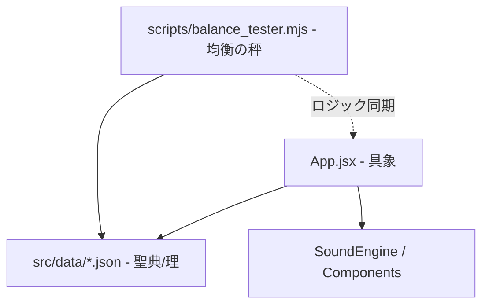

# 平安魔道伝 - 都の構造図 (SYSTEM_ARCHITECTURE)

本頁には、RPG「Rashomon: Moonlight Melodies of the Underworld」を構成する都の理（システム設計）を記す。

## 1. 大局的な理 (Overall Architecture)

都は、**「具象（UI/UX）」** と **「理（JSONデータ）」**、そして **「検証（Simulator）」** の三位一体によって構築される。

### 1-1. 具象 (React Frontend)
- **Framework**: React 19 (Vite)
- **Logic**: `App.jsx` が全ての状態（GameState, Party, Map）を統括する。
- **Styling**: Vanilla CSS (`index.css`) による平安美学の具現化。

### 1-2. 理 (Data-Driven Design)
都の挙動を左右するすべての変数は、`src/data/` 以下の聖典（JSON）に委ねられる。これによって、コードを汚さずして均衡（バランス）の微調整が可能となる。
- `Balance.json`: 命中率、遭遇率、経験値曲線、ボスの位置。
- `Enemies.json`: 怪異（モンスター）の能力値、名、姿の定義。
- `Characters.json`: 隊員の初期値、職（Job）の定義。
- `Spells.json`: 祈祷・術法の効果、消費霊力。
- `Scenario.json`: 物語の言霊、UI メッセージ。

### 1-3. 検証 (Automated Verification)
`scripts/balance_tester.mjs` は、人間が UI を操作する「実時間」と「確率」を考慮し、Node.js 上で数万サイクルの探索・戦闘を高速に試行する。これにより、クリアに至るまでの「苦難（全滅回数）」や「プレイ時間」を KPI として可視化する。

## 2. 都の状態遷移 (State Management)

都は以下の五つの相（GameState）を巡り、生死の理を表現する。

1. **PROLOGUE**: 序章、都の門が開く瞬間の言霊。
2. **EXPLORING**: 迷宮の行軍、怪異との遭遇。
3. **BATTLE**: 刃を交える修羅の相。
4. **DEAD**: 全滅、黄泉の井戸。
5. **EPILOGUE**: 怪異調伏後の結末。

## 3. 開発の掟 (Development Principles)
- **Code is logic, JSON is data**: ロジックの変更は最小限とし、調整は JSON の書き換えで解決すること。
- **Fail-Safe Design**: 未定義の座標や不正なデータに対しても、都の崩壊（クラッシュ）を防ぐ堅牢性を維持すること。

---
*本典は、都の拡張に伴い、常に最新の理を反映し続けるものとする。*
